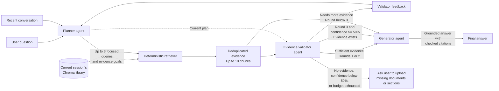

# Folio · Configurable agentic document research

A local POC with a Next.js/TypeScript research workspace and a single-worker
FastAPI backend. Independently registered agents and tools run in the workflow
you configure. The default LangGraph workflow plans searches, retrieves from a
temporary Chroma library, checks evidence, and generates a cited answer using Groq.

## Setup and run

Use Python 3.11+, uv, and Node.js 22+ with npm. Run all Python commands through this
project's interpreter: copied virtual-environment activation scripts and console
launchers can still point to the original Streamlit project.

```sh
cd /Users/npt/Oracle/workspaces/ideas/configurable-agentic-rag-chatbot
# Create .venv only if it does not already exist:
python3 -m venv .venv
uv pip sync requirements.txt --python .venv/bin/python
test -f .env || cp .env.example .env
# Set GROQ_API_KEY in .env if not already configured.
cd frontend
npm ci
npm run build
```

Run the backend:

```sh
cd /Users/npt/Oracle/workspaces/ideas/configurable-agentic-rag-chatbot
.venv/bin/python -m uvicorn rag_chat.api:app --host 127.0.0.1 --port 8000 --workers 1
```

Open **http://127.0.0.1:8000**. API documentation is at
**http://127.0.0.1:8000/docs**. FastAPI serves both the static Next.js export and
`/api/*`; the Groq key stays in Python. Re-run `npm run build` after frontend
changes, then restart Python to load the new export. If `frontend/out` has not been
built, FastAPI starts API-only and the root page returns 404. Shell environment
values override `.env`.

Use one API worker: multiple workers do not share this POC's in-memory libraries.
Saved workflows belong to the current session ID, so another session cannot list,
edit, delete, or run them. Restarting Python clears sessions, documents, chats, and
operation history, making their workflows inaccessible. The workflow rows remain in
`.data/workflows.sqlite3` (or the path in `FOLIO_WORKFLOWS_DB`). Existing shared
custom workflows from older database versions are retained there but hidden from
sessions because they have no owner.

## Deploy on Render

The root `Dockerfile` builds the static Next.js workspace and serves it with FastAPI
in one Docker Web Service. Push this repository to GitHub, then in Render choose
**New → Web Service** and connect `navaneethpt/configurable-agentic-rag` on `main`.
Use these settings:

| Setting | Value |
|---|---|
| Language | Docker |
| Root Directory | Leave blank (repository root) |
| Dockerfile Path | `./Dockerfile` (the default) |
| Health Check Path | `/api/health` |
| Instances | One; session libraries live in process memory |

In **Environment**, add `GROQ_API_KEY` as a secret value. Do not add the key to the
Dockerfile or commit `.env`. Render supplies `PORT`; the Docker command listens on
`0.0.0.0:$PORT` with one worker. After deployment, open the service URL and check
`/api/health` for `"answering_configured": true` before uploading a small document
and asking a question. The Docker image includes the embedding model; indexing
still uses memory, so large documents may require a plan with more RAM.

This is a temporary-session POC. A restart or Free-plan spin-down discards document
libraries and session IDs. Saved workflows are then inaccessible even if their
SQLite file remains on a persistent disk; a disk alone does not make sessions
recoverable. Public Web Services also expose the upload and chat endpoints to
anyone with the URL, which can consume the configured Groq API key.

## Use the workspace

1. Choose or drop PDF, DOCX, TXT, or Markdown files and select **Process documents**.
2. Wait for the per-file result. A bad file does not prevent later files processing.
3. Ask a question. The Research panel shows the nodes your selected workflow runs,
   including intermediate drafts, searches, and evidence checks when configured.
4. The terminal node's answer or context request appears in the conversation.
   Supported answers must pass citation checks. Click a numbered citation
   to inspect its exact source passage; **View research** opens an earlier answer's trace.
5. Clear session removes both documents and the conversation. On a narrow screen,
   use the document and research buttons in the header to open the drawers.

Select **How the agents work** in the research banner to see the default graph,
the role of each agent and tool, its evidence-routing choices, and its settings.
Select **Configure agents** in the header or banner to build a workflow. Choose a saved workflow or
copy the default, add agent and tool nodes from the server catalog, set each node's
settings, and connect its named outputs to other nodes. Choose a start node and
save. Saving also activates the workflow for new questions in this browser tab.
Each node receives the original question and all earlier outputs from its executed
path. Nodes handle missing context independently: a generator alone asks for
context, while retrieval followed by generation searches directly with the question
and produces a cited answer. Planner and validator are optional. Answer generators
and Request more evidence can finish a workflow or continue to another node;
only the terminal response is shown to the user. A document upload is still required.
The active workflow and version appear above the chat. Earlier answers retain the
workflow name and version used when they ran. See [Workflow authoring](docs/workflows.md)
for the graph contract and how to add a new Python agent or tool.

Uploads are limited to 20 MB each and 10 indexed documents per session. Extraction
supports text PDFs, DOCX body paragraphs/tables, and UTF-8 text/Markdown; OCR,
encrypted PDFs, DOCX headers/footers, and embedded objects are unsupported. Each
document is capped at 2 million extracted characters and 10,000 chunks. Identical
bytes are deduplicated; changed bytes count as a new document. Indexing failures
roll back the document; rollback failure requires clearing the session.

The initial upload downloads the local MiniLM ONNX embedding model (about 80 MB).
Later sessions reuse its cache. Uploads work without a Groq key; answering requires
a key and connectivity. Questions, bounded recent conversation, and retrieved
excerpts are sent to Groq. Original files are not retained after processing;
multipart parsing may temporarily spool an upload to a temporary file, which is
closed after it is read. Extracted text and vectors stay in memory.

## Agent and session behavior

### Each agent works independently

Every node receives the original question, recent conversation, and ordered outputs
from earlier steps on the executed path. Each produces its own structured output
and selects a routing outcome separately. Missing upstream results do not prevent
saving a workflow; each agent handles the available inputs when it runs.

| Agent or tool | Individual function | When earlier results are missing |
|---|---|---|
| Search planner | Produce focused queries from the question and relevant prior context | Plan from the question and conversation |
| Document retrieval | Search the session vector library and return deduplicated passages, source metadata, and queries used | Search directly with the original question if no plan exists |
| Evidence validator | Assess available passages against the question and queries; return sufficiency, confidence, and evidence gaps | Report insufficient evidence if no passages exist |
| Answer generator | Produce a cited answer from supporting passages, or a structured context request | Validation is optional; without supporting context, ask for what is needed |
| Request more evidence | Describe missing evidence or request relevant documents | Make a general request if no evidence gaps were supplied |

For example, **Generator alone** requests context; it does not search uploaded
documents automatically. **Retrieval → Generator** searches with the question and
answers from passages without a planner or validator. **Planner → Generator** and
**Validator → Generator** can run, but request context because neither retrieves
passages. Document upload is required for all these workflows.

Generators and evidence requests can finish or continue. Intermediate outputs are
available to later nodes, but only the terminal response becomes the assistant
message. Generated drafts are not document evidence. Results retain node IDs,
types, and execution steps, so repeated nodes do not overwrite earlier results.
Validation from before a later retrieval is not used to validate that newer evidence.
The runner executes exactly the saved graph, with sequential routing and bounded
retry loops. It does not insert missing agents.

### The default configuration

The saved default graph is `planner → retrieve → validate → generate`, with a
feedback edge from validation to planning and a missing-evidence exit. Its defaults
allow 3 rounds, 3 searches per round, 3 hits per search, and 10 unique chunks.
The planner resolves follow-ups from the last 5 exchanges. These settings and
agent instructions/models can be changed in a saved workflow. A workflow also has
a maximum step count to bound custom loops.



In this default configuration, the planner proposes searches, the deterministic
retriever searches only the current session's Chroma collection, and the validator
routes to generation, another search, or an evidence request. These connections
are editable; other workflows can invoke each agent independently.

Structured replies are validated with Pydantic and get one repair attempt. By
default, the first two validation attempts require a `sufficient` decision. On the
third, confidence of at least 0.5 allows generation even when some evidence is
missing; below 0.5 the chatbot requests missing documents or sections. Confidence is
the validator model's own estimate, not a calibrated probability of correctness.
Duplicate retrievals or a full 10-chunk evidence set do not prevent the third
validation attempt; the full set is reused when no further chunks can be added.
An empty evidence set never passes. Research shows confidence and threshold
acceptance, and the generator must identify unresolved gaps in a fallback answer.
The generator makes one correction attempt if citation checks fail and rejects an
invalid corrected response. Numbered citations are checked for valid references; this does not prove
every generated claim is correct.

Each browser tab keeps an opaque session ID in `sessionStorage`. Python owns the
chat history. Refresh restores that session, including completed answers and
traces. After one hour of inactivity it expires; polling does not extend the idle
timer. Active work is protected from expiry and restarts the timer on completion.
Clearing and conflicting requests are rejected while an operation is running.

Disconnecting does not cancel an accepted operation. Research completes in Python;
the browser polls session status while streaming to recover the saved result if a
proxy loses the final event or leaves the connection open. An answer or error event
ends the browser's stream immediately, without waiting for the connection to close.
It never automatically resubmits a question. Traces show observable actions and
explicit agent outputs, not private model reasoning. Workflow definitions are
saved in SQLite and owned by the session that created them; other sessions cannot
list, edit, delete, or run those workflows. The default template is shared.
Document libraries and chats remain temporary and isolated by session ID. There
is no authentication or external tracing configuration. Session IDs provide
isolation within this POC; sessions remain temporary when hosted on Render.

## API

Session, document, chat, and workflow requests include `X-Session-ID`, except when
creating a session. The node catalog is server-wide and requires no session header.

| Method/path | Purpose |
|---|---|
| `GET /api/health` | Availability and answering configuration |
| `GET /api/node-types` | Registered agents/tools, accepted inputs, output and setting schemas, routing outcomes, and terminal capability |
| `GET /api/workflows` | List saved definitions and versions |
| `GET /api/workflows/{id}` | Read one saved definition |
| `POST /api/workflows` | Validate and save a new definition |
| `PUT /api/workflows/{id}` | Save a new version with the expected version number |
| `DELETE /api/workflows/{id}` | Delete a custom definition |
| `POST /api/sessions` | Create a temporary library |
| `GET /api/session` | Read documents, messages, traces, and operation status |
| `DELETE /api/session` | Delete an idle session |
| `POST /api/documents` | One multipart `file`; indexed, duplicate, or failed result |
| `POST /api/chat` | JSON `question` and optional `workflow_id`; SSE progress and a terminal answer or error |

Missing session headers return 400, expired sessions 410, conflicting work 409,
and oversized uploads 413. Unknown workflows return 404 and invalid workflow
definitions 422. Graph/provider errors after streaming starts arrive as
an `error` event and are not added to the conversation.

## Validation

```sh
# From project root; offline mocks, no credentials/model download:
.venv/bin/python -m pytest -q
cd frontend
npm run typecheck
npm test
npm run build
npx playwright install chromium
npm run test:e2e
```

If the browser download is unavailable but Google Chrome is installed, use
`PLAYWRIGHT_CHANNEL=chrome npm run test:e2e`. Tests launch a separate automated
browser profile. The frontend lockfile uses the Yarn npm-package mirror because
the local Oracle gateway certificate could not be verified for the default npm
registry; TLS verification remains enabled.

The static build uses Next.js's Webpack option; the default Turbopack CSS compiler
could not bind its helper port in this environment.

Browser tests first build the static export, then launch a test-only FastAPI server
on 8100. That server serves the same export together with real in-memory Chroma,
deterministic embeddings, and mocked Groq output. They exercise uploads, citations,
evidence gaps, workflow editing and execution, refresh/disconnect recovery, expiry,
clearing, and mobile drawers.
Screenshots are written under `frontend/test-results`. The test server's expiry
endpoint exists only in `tests/fake_api.py`.

Optional real-embedding test (may download model files):

```sh
RAG_TEST_REAL_EMBEDDINGS=1 .venv/bin/python -m pytest -q tests/test_embedding_smoke.py
```

Regenerate Python pins with:

```sh
uv pip compile pyproject.toml --extra test --universal --python-version 3.11 -o requirements.txt
```

Next.js and Python are independently installable; `frontend/package-lock.json`
and `requirements.txt` record their resolved dependencies.
